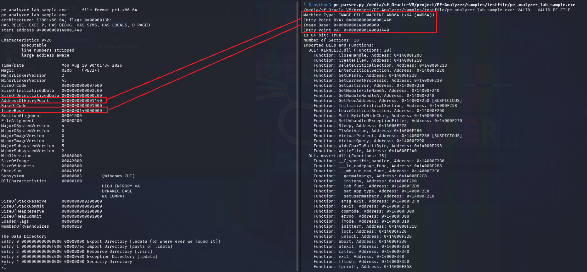
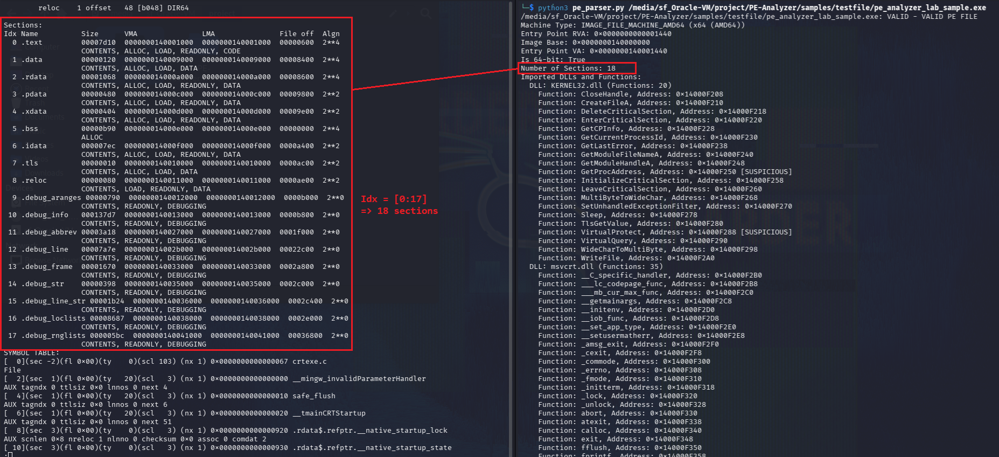
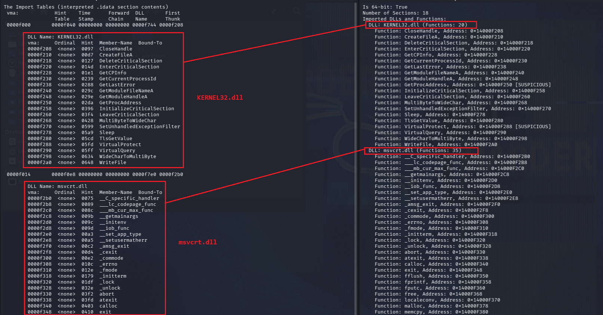

## Task
- Sử dụng thư viện `pefile.PE(file_path)` để mở file và trích xuất các thông tin cơ bản: Machine type
- Trích xuất danh sách các DLL được nạp (`DIRECTORY_ENTRY_IMPORT`) và danh sách các hàm Windows API tương ứng.
- Kiểm tra với Sample Test file

## Nguyên lý cấu trúc của Import Table trong PE file

Trong cấu trúc PE Windows, Import Table (IMAGE_DIRECTORY_ENTRY_IMPORT tại mục số 1 của Data Directories) chứa danh sách các thư viện liên kết động (.dll) và các hàm Windows API mà chương trình cần nạp vào bộ nhớ khi khởi chạy.

```
pe.OPTIONAL_HEADER.DATA_DIRECTORY[1] (Import Directory)
                    │
                    ▼
       [ pe.DIRECTORY_ENTRY_IMPORT ]
                    │
    ┌───────────────┴───────────────┐
    ▼                               ▼
[ Entry 1: KERNEL32.dll ]       [ Entry 2: USER32.dll ]
    │                               │
    ├── imp.name: 'VirtualAlloc'    ├── imp.name: 'MessageBoxA'
    ├── imp.name: 'CreateProcessW'  └── imp.ordinal: 12 (nếu import theo Ordinal)
    └── imp.address: 0x00401038
```

## Hướng triển khai bằng `pefile` library

```
                                [ Input: file_path ]
                                         │
                                         ▼
                            [ pefile.PE(file_path) ]
                                         │
                  ┌──────────────────────┴──────────────────────┐
                  ▼                                             ▼
          [ FILE_HEADER ]                               [ OPTIONAL_HEADER ]
                  │                                             │
      pe.FILE_HEADER.Machine                       - AddressOfEntryPoint (RVA)
                  │                                - ImageBase
                  ▼                                - Magic (PE32 / PE32+)
    Ánh xạ mã Hex sang tên:                                     │
    - 0x8664 -> x64 (AMD64)                                     ▼
    - 0x014C -> x86 (I386)                         Tính Virtual Address (VA):
    - 0xAA64 -> ARM64                               EntryPoint VA = ImageBase + RVA
                  │                                             │
                  └──────────────────────┬──────────────────────┘
                                         ▼
                             [ Đóng gói vào PEInfo ]
                                         │
                                         ▼
                                   [ pe.close() ]
```

Quy trình cụ thể gồm:

- **Step 1**: Kiểm tra nạp file với `pefile.PE(path, fast_load = True)`. Flag `fast_load` dùng để tăng tốc độ phân tích (chỉ đọc Header chính, không load toàn bộ Data Directories khi chưa cần).
- **Step 2**: Parsing Machine Type. Sử dụng truy xuất `pe.FILE_HEADER.Machine` tra cứu qua từ điển `pefile.MACHINE_TYPE` bằng ánh xạ `MACHINE_ARCH_MAP`
- **Step 3**: Trích xuất Entry Point và ImageBase. Cụ thể:

    - RVA: `pe.OPTIONAL_HEADER.AddressOfEntryPoint`
    - ImageBase: `pe.OPTIONAL_HEADER.ImageBase`
    - EntryPoint VA: $VA=ImageBase+AddressOfEntryPoint.$
- **Step 4**: Đóng gói kết quả và dataclass `PEInfo`:
    ```python
    @dataclass
    class PEInfo:
        # This dataclass is used to store the information of a PE file.
        path: str
        machine_raw: int
        machine_name: str
        machine_arch: str
        entry_point_rva: int
        entry_point_rva_hex: str
        image_base: int
        image_base_hex: str
        entry_point_va: int
        entry_point_va_hex: str
        is_64bit: bool
        number_of_sections: int
        compile_time: Optional[int]
    ```

Quy trình được thể hiện qua Source Code như sau:
```python
    try:
        # Get Machine Type from Header
        machine_raw = pe.FILE_HEADER.Machine
        machine_name = pefile.MACHINE_TYPE.get(machine_raw, f"UNKNOWN_MACHINE_0X{machine_raw:04X}")
        machine_arch = MACHINE_ARCH_MAP.get(machine_raw, machine_name)

        # Get Entry Point and ImageBase from OPTIONAL_HEADER
        entry_point_rva = getattr(pe.OPTIONAL_HEADER, 'AddressOfEntryPoint')
        image_base = getattr(pe.OPTIONAL_HEADER, 'ImageBase')
        entry_point_va = image_base + entry_point_rva

        # Hexadecimal representations
        magic = getattr(pe.OPTIONAL_HEADER, 'Magic')
        is_64bit = magic == 0x20B  # PE32+ (64-bit)

        hex_fmt = lambda x: f"0x{x:08X}" if not is_64bit else f"0x{x:016X}"
        entry_point_rva_hex = hex_fmt(entry_point_rva)
        image_base_hex = hex_fmt(image_base)
        entry_point_va_hex = hex_fmt(entry_point_va)

        number_of_sections = pe.FILE_HEADER.NumberOfSections
        compile_time = pe.FILE_HEADER.TimeDateStamp if hasattr(pe.FILE_HEADER, 'TimeDateStamp') else None

        return PEInfo(
            path=str(path),
            machine_raw=machine_raw,
            machine_name=machine_name,
            machine_arch=machine_arch,
            entry_point_rva=entry_point_rva,
            entry_point_rva_hex=entry_point_rva_hex,
            image_base=image_base,
            image_base_hex=image_base_hex,
            entry_point_va=entry_point_va,
            entry_point_va_hex=entry_point_va_hex,
            is_64bit=is_64bit,
            number_of_sections=number_of_sections,
            compile_time=compile_time
        )
```

## Hướng triển khai phân tích Import Table và DLLs

Quy trình cụ thể:

- Step 1: Access vào `pe.DIRECTORY_ENTRY_IMPORT`. Sử dụng `pe.parse_data_directories()` để đảm bảo Import Table được nạp đầy đủ. Nếu file không có thì trả về List rỗng.
- Step 2: Trích xuất tên `DLLs`. Thực hiện giải mã từ `bytes` sang `string` với tuỳ chọn `errors = "replace"`
- Step 3: Trích xuất danh sách API functions
- Step 4: Lọc và phát hiện các API nhạy cảm theo list sau
    ```python
    # List of Windows API functions that are suspicious and may indicate malicious behavior
    SUSPICIOUS_API: Set[str] = {
        # Memory Allocation & Protection
        "VirtualAlloc", "VirtualAllocEx", "VirtualProtect", "VirtualProtectEx",
        "WriteProcessMemory", "ReadProcessMemory", "MapViewOfFile",
        # Process & Thread Injection / Execution
        "CreateProcessA", "CreateProcessW", "CreateRemoteThread", "OpenProcess",
        "QueueUserAPC", "SetThreadContext", "ResumeThread", "NtUnmapViewOfSection",
        # Dynamic Loading
        "LoadLibraryA", "LoadLibraryW", "LoadLibraryExA", "LoadLibraryExW",
        "GetProcAddress", "LdrLoadDll",
        # Persistence & System Modification
        "RegCreateKeyExA", "RegCreateKeyExW", "RegSetValueExA", "RegSetValueExW",
        "RegOpenKeyExA", "RegOpenKeyExW",
        # Network & Communication
        "InternetOpenA", "InternetOpenW", "InternetOpenUrlA", "InternetOpenUrlW",
        "HttpSendRequestA", "HttpSendRequestW", "URLDownloadToFileA", "URLDownloadToFileW",
        "WSAStartup", "socket", "connect", "send", "recv",
        # Anti-Analysis / Evasion
        "IsDebuggerPresent", "CheckRemoteDebuggerPresent", "NtQueryInformationProcess",
        "GetTickCount", "OutputDebugStringA", "OutputDebugStringW",
        # Keylogging & Hooking
        "SetWindowsHookExA", "SetWindowsHookExW", "GetAsyncKeyState", "GetKeyState"
    }
    ```

- Step 5: Đóng gói data bằng 2 dataclass `ImportedFunction` và `ImportedDLL`, tích hợp trực tiếp vào `PEInfo` và build giao diện `print_imports()`

    - Lớp `ImportedFunction`:
        ```python
        @dataclass
        class ImportedFunction:
            # This dataclass represents an Windows API function imported by a PE file.
            name: Optional[str]
            ordinal: Optional[int]
            address: int
            is_ordinal: bool
            is_suspicious: bool

            @property
            def display_name(self) -> str:
                return self.name if self.name else f"Ordinal_{self.ordinal}" if self.ordinal is not None else "Unknown"

            @property
            def hex_address(self) -> str:
                return f"0x{self.address:08X}"
        ```
    - Lớp `ImportedDLL`:
        ```python
        @dataclass
        class ImportedDLL:
            # This class represents a DLL imported by a PE file, along with its imported functions.
            dll_name: str
            functions: list[ImportedFunction] = field(default_factory=list)

            @property
            def function_count(self) -> int:
                return len(self.functions)
        ```
    - Xây dựng `print_imports()`:
        ```python
        def print_imports (imports: List[ImportedDLL]) -> None:
            if not imports:
                print("No imported DLLs found.")
                return

            print("Imported DLLs and Functions:")
            for dll in imports:
                print(f"  DLL: {dll.dll_name} (Functions: {dll.function_count})")
                for func in dll.functions:
                    suspicious_flag = " [SUSPICIOUS]" if func.is_suspicious else ""
                    print(f"    Function: {func.display_name}, Address: {func.hex_address}{suspicious_flag}")
        ```

Source code:
```python
    try:
        # Make sure Data Directory for imports is present
        if not hasattr(pe_instance, 'DIRECTORY_ENTRY_IMPORT'):
            pe_instance.parse_data_directories(directories=[pefile.DIRECTORY_ENTRY['IMAGE_DIRECTORY_ENTRY_IMPORT']])

        imported_dlls: List[ImportedDLL] = []

        if hasattr(pe_instance, 'DIRECTORY_ENTRY_IMPORT'):
            for entry in pe_instance.DIRECTORY_ENTRY_IMPORT:
                # Extract DLL name
                dll_name = entry.dll.decode('utf-8', errors='ignore') if entry.dll else "Unknown DLL"
                functions: List[ImportedFunction] = []

                # Extract imported functions
                for imp in getattr(entry, 'imports', []):
                    is_ordinal = imp.name is None
                    func_name = imp.name.decode('utf-8', errors='ignore') if imp.name else None
                    ordinal = getattr(imp, 'ordinal', None)
                    address = getattr(imp, 'address', 0)

                    is_suspicious = func_name in SUSPICIOUS_API if func_name else False

                    functions.append(ImportedFunction(name=func_name, ordinal=ordinal, address=address, is_ordinal=is_ordinal, is_suspicious=is_suspicious))

                imported_dlls.append(ImportedDLL(dll_name=dll_name, functions=functions))
        return imported_dlls
```

## Kiểm tra với Sample Test File

### Thực hiện tạo Sample Test File với `windows.h`

**Source code**:
```c
#define WIN32_LEAN_AND_MEAN
#include <windows.h>
#include <stdio.h>
#include <string.h>

int main(void) {
    const char *marker_name = "pe_analyzer_lab_marker.txt";
    const char *marker_text =
        "This file was created by a harmless PE Analyzer lab sample.\r\n";
    char module_path[MAX_PATH] = {0};
    DWORD written = 0;

    GetModuleFileNameA(NULL, module_path, sizeof(module_path));
    printf("PE Analyzer lab sample (benign)\n");
    printf("Executable: %s\n", module_path[0] ? module_path : "<unknown>");
    printf("Process ID: %lu\n", (unsigned long)GetCurrentProcessId());

    HANDLE marker = CreateFileA(marker_name, GENERIC_WRITE, 0, NULL,
                                CREATE_ALWAYS, FILE_ATTRIBUTE_NORMAL, NULL);
    if (marker == INVALID_HANDLE_VALUE) {
        fprintf(stderr, "Could not create %s (error %lu).\n", marker_name,
                (unsigned long)GetLastError());
        return 1;
    }

    BOOL ok = WriteFile(marker, marker_text, (DWORD)strlen(marker_text),
                        &written, NULL);
    CloseHandle(marker);
    if (!ok) {
        fprintf(stderr, "Could not write marker (error %lu).\n",
                (unsigned long)GetLastError());
        return 1;
    }

    printf("Created %s (%lu bytes).\n", marker_name, (unsigned long)written);
    return 0;
}
```

Set up môi trường để Compile Sample Test File:

```bash
sudo apt update
sudo apt install -y mingw-w64
```

Chạy cmd để build `.exe` file:

```bash
x86_64-w64-mingw32-gcc -std=c11 -O2 -Wall -Wextra \-o pe_analyzer_lab_sample.exe pe_analyzer_lab_sample.c
```

### Kiểm tra đối chiếu với file thật

Dùng `objdump` để trích xuất thông tin trên Test file:

```bash
objdump -x pe_analyzer_lab_sample.exe | less
```

Đối chiếu kết quả parsing bằng `pefile`:

- Kiểm tra EntryPoint và ImageBase:

    

- Kiểm tra số lượng Sections:

    

Đối chiếu kết quả phân tích Import Tables và DLL:



**KẾT QUẢ TRÙNG KHỚP 100%**